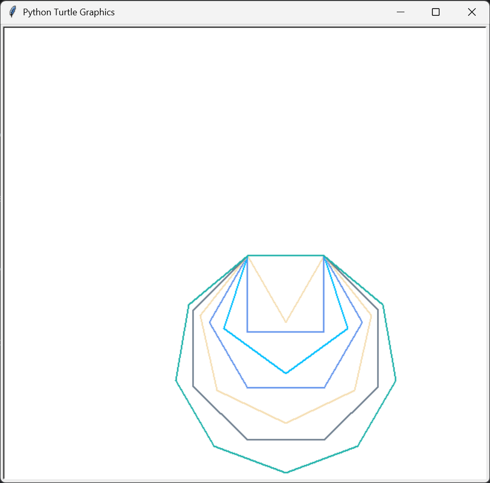
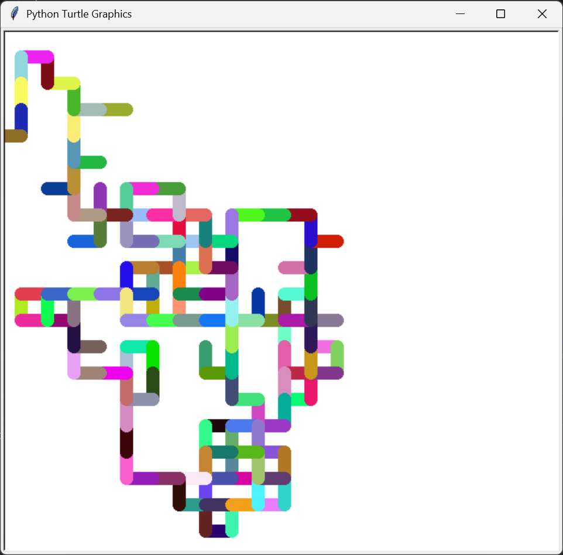

# Shape Spectrum

A simple Python Turtle project that draws colorful polygons from triangle to nonagon.

## Features

- Draws regular polygons from 3 to 9 sides
- Uses random colors for each shape
- Built with Python's built-in `turtle` module

## Output

# Random Walk Turtle

A Python Turtle project that draws a colorful random walk using random directions and RGB colors.

## Features

- Randomly changes direction
- Uses custom RGB colors
- Draws thick, colorful paths
- Fast animation with Turtle

- ## Output

  

# Spirograph Turtle

A Python Turtle project that draws a colorful spirograph pattern using overlapping circles and random RGB colors.

## Features

- Draws a spirograph using circles
- Random RGB color for each circle
- Adjustable angle gap between circles
- Fast animation with Turtle

- - ## Output

  
