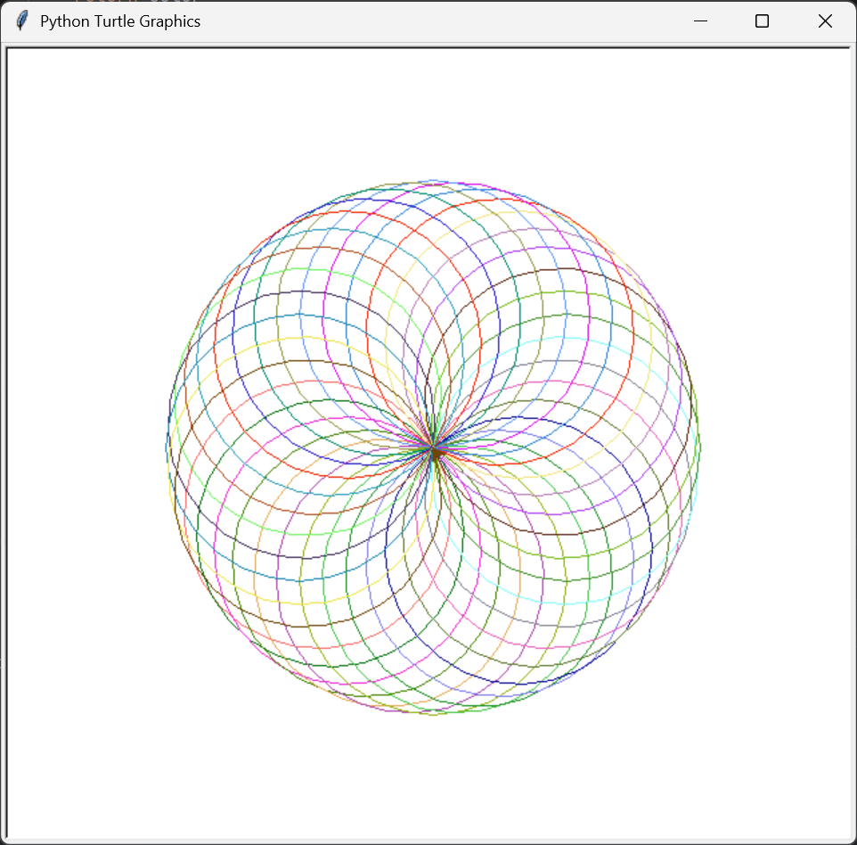
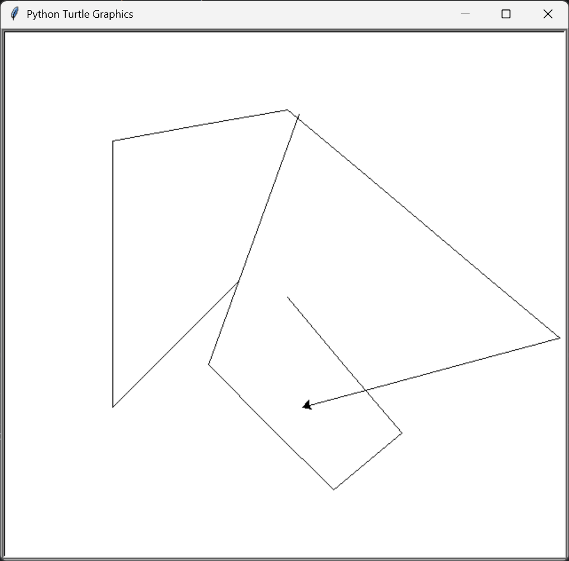

# Python Turtle Art

A collection of small Python Turtle projects that create colorful shapes, patterns, and animations.

## Projects

### 1. Shape Spectrum

Draws colorful regular polygons from triangle to nonagon.

**Features**
- Draws regular polygons from 3 to 9 sides
- Uses random colors for each shape
- Built with Python's built-in `turtle` module

**Output**  


---

### 2. Random Walk Turtle

Draws a colorful random walk using random directions and RGB colors.

**Features**
- Randomly changes direction
- Uses custom RGB colors
- Draws thick, colorful paths
- Fast animation with Turtle

**Output**  


---

### 3. Spirograph Turtle

Draws a colorful spirograph pattern using overlapping circles and random RGB colors.

**Features**
- Draws a spirograph using circles
- Random RGB color for each circle
- Adjustable angle gap between circles
- Fast animation with Turtle

**Output**  


---

## How to Run

1. Clone or download this repository.
2. Open a terminal in the project folder.
3. Run the desired script:

```bash
python shape_spectrum.py
python random_walk.py
python spirograph.py
```

## Requirements

- Python 3
- Turtle module (built into Python)

### 3. Etch-a-sketch app

A simple Python Turtle project that lets you control a turtle using keyboard keys.

## Controls

| Key | Action |
|-----|--------|
| `W` | Move forward |
| `S` | Move backward |
| `A` | Turn left |
| `D` | Turn right |
| `C` | Clear and reset |


**Output**  

